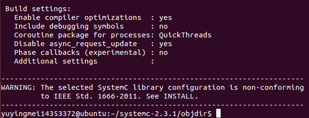
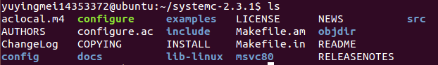
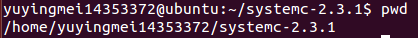
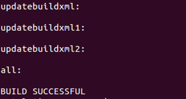
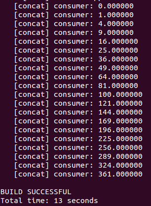

# DOL开发环境配置

### DOL框架描述

*The distributed operation layer (DOL) is a software development framework to program parallel applications. The DOL allows to specify applications based on the Kahn process network model of computation and features a simulation engine based on SystemC. Moreover, the DOL provides an XML-based specification format to describe the implementation of a parallel application on a multi-processor systems, including binding and mapping.*

### DOL配置过程

1. 在虚拟机(ubuntu)中安装一些必要的环境
		
			$   sudo apt-get update
			$	sudo apt-get install ant
			$ 	sudo apt-get install openjdk-7-jdk
			$	sudo apt-get install unzip
2. 在虚拟机中下载文件
 
			sudo wget http://www.accellera.org/images/downloads/standards/systemc/systemc-2.3.1.tgz
			sudo wget http://www.tik.ee.ethz.ch/~shapes/downloads/dol_ethz.zip

3. 解压文件

	*新建dol文件夹*

			$	mkdir dol

	*将dolethz.zip解压到dol文件夹中*

			$	unzip dol_ethz.zip -d dol
	 *解压systemc*

			$	tar -zxvf systemc-2.3.1.tgz

4. 编译systemc

	*解压后进入systemc-2.3.1的目录下(该目录在根目录下)*

			$	cd systemc-2.3.1
	*新建一个临时文件夹objdir*

			$	mkdir objdir
	*进入该文件夹objdir*

			$	cd objdir
	*运行configure(能根据系统的环境设置一下参数，用于编译)*

			$	../configure CXX=g++ --disable-async-updates

	*运行结果截图*	
	
	 

	*如上图所示，我们目前进入了根目录下的systemc-2.3.1文件下的objdir中，然后进行如下编译*

			$	sudo make install
	*编译完成后，进入systemc-2.3.1目录下，可观察到该文件下的目录如下*
	
	

	
	*记住当前的工作路径，如下图*

			$	pwd
	

5. 编译dol
	
	*进入刚刚的dol文件夹(在根目录下)*
			
			$	cd ../dol
	*在虚拟机的文件中，找到dol文件里面的build_zip.xml文件，以记事本方式打开，找到如下图所示语句，并把这两个语句的工作路径改成pwd的结果，如下图所示*

			<property name="systemc.inc“ value="/home/shapes/base/resources/lib/systemC/include"/>
			<property name="systemc.lib" value="/home/shapes/base/resources/lib-linux/libsystemc.a"/>
			
			<property name="systemc.inc“ value="/home/yuyingmei14353372/systemc-2.3.1/include"/>
			<property name="systemc.lib" value="/home/yuyingmei14353372/systemc-2.3.1/lib-linux/libsystemc.a"/>
	*编译*

			$	sudo ant -f build_zip.xml all

	*若成功，则显示下图*

	

	*运行第一个例子(build在dol目录下，dol在根目录下)*

			$	cd build/bin/main
			$	sudo ant -f runexample.xml -Dnumber=1
	*若成功，则出现如下图所示*

	

6. 配置完成！！！

### 实验感想

在本次配置实验过程中，进行的很顺利，并没有遇到什么错误；需要注意的是在步骤5-修改build_zip.xml文件时，如果虚拟机是64位的话，要把*lib-linux*改成*lib-linux64*，因为我的虚拟机是32位，所以不用改。另外，由于刚开始接触github，所以对于git，dol什么的都不太理解。

				
		

		
			

			
