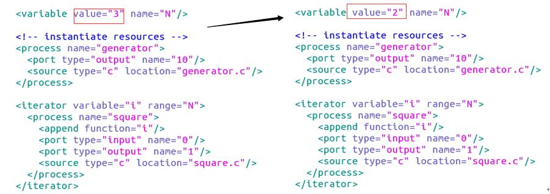

# DOL 实例分析&编程

###  修改example1，使其输出3次方数，tips:修改square.c

1. 修改代码之前，先进入到dol/build/bin/main目录下，可以看到example1文件夹，先把它删掉，因为这是上次编译生成的，本次实验修改完代码后会生成新的example1.

2. 在上一步骤中若看到build目录是加锁的，则它里面的example1是删不掉的，可以新建一个文件夹build1，与build文件夹在同一目录下，把build里面的东西全部复制到build1中，打开终端，执行以下指令，把build文件夹删掉，然后再把build1改名为build，进入文件夹里面，删掉example1.

			$   sudo rm dol/build -r
3. 修改代码：进入dol/examples/example1/src目录下，打开square.c文件，做如下修改
	 
	*这部分代码是定义平方进程，square_fire为信号处理函数，读入输入端信号i，将其三次方后写出到输出端，也是重复length次之后就停止了*

4. 运行结果截图
	
			$   cd dol/build/bin/main
			ant -f runexample.xml -Dnumber=1
	*终端输入上述指令，可以看到运行结果如下*
	
	 

	*generator 产生0-19的整数（length为20，初始值为0）,  square 对输入进行三次方操作，  consumer 输出结果*
	
	

	*运行example1之后的dot图(在dol/build/bin/main/example1中双击example1.dot即可)，其中包含生产者、平方模块、消费者3个框， 通道C1与C2两条线*

###  修改example2，让3个square模块变成2个, tips:修改xml的iterator

1. 进入目录dol/examples/example2，打开文件example2.xml，修改代码如下：
	 
	*修改后的代码，N=2，然后在迭代那里，相当于for循环两次，则通过迭代，定义了两个square模块*

2. 运行结果截图
	
			$   cd dol/build/bin/main
			ant -f runexample.xml -Dnumber=2
	*终端输入上述指令，可以看到运行结果如下*
	
	 

	*generator 产生0-19的整数（length为20，初始值为0）,  square 经过两次次平方操作，  consumer 输出结果*
	
	

	*运行example2之后的dot图(在dol/build/bin/main/example2中双击example2.dot即可)，其中包含生产者、两个平方模块、消费者4个框， 通道C2_0,C2_1与C2_2三条线*

###  实验感想

本次实验主要是理解两个example的源代码及其实现功能，然后按照课件提示进行修改，所以做起来还是挺快的，另外本次实验唯一遇到的问题就是无法删除example1文件夹在编译运行example1之前，原因就是build文件夹加上了锁，所以在终端通过指令(实验步骤中有写)来删除该文件夹，之后就可以顺利编译运行了。

