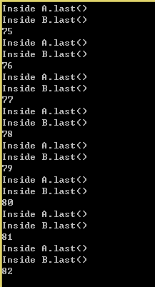
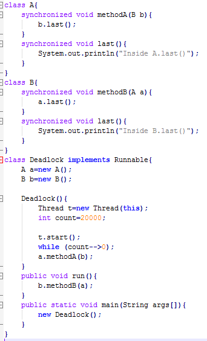

## 死锁
### 1. 产生死锁的4个必要条件
死锁就是两个或者多个进程，互相请求对方占有的资源。

* 互斥条件：一个资源每次只能被一个进程使用

* 请求与保持条件：一个进程因请求资源而阻塞时，对已获得的资源保持不放

* 不剥夺条件:进程已获得的资源，在末使用完之前，不能强行剥夺

* 循环等待条件:若干进程之间形成一种头尾相接的循环等待资源关系

### 2. 死锁停在第几次的截图

*由图可以看出在第82次产生了死锁*

 

### 3. 对上述程序产生死锁的解释

*实验关键代码如下*

*代码分析如下*

* 关键字 synchronized: 
*当它用来修饰一个方法或者一个代码块的时候，能够保证在同一时刻最多只有一个线程执行该段代码。当一个线程访问object的一个synchronized同步代码块或同步方法时，其他线程对object中所有其它synchronized同步代码块或同步方法的访问将被阻塞*

* 死锁：
*Deadlock函数相当于主线程，run函数那里是子线程。实验开始在主线程中创建了子线程t，然后t.start()之后，线程t就被插入到调度队列里,然后主线程等待20000，之后执行a对象的methodA方法，当在执行过程中，主线程的时间片用完了，则cpu调度子线程,子线程执行b对象的methodB方法，这个方法里面是调用a对象的last()方法，而这个代码块带着synchronized，主线程又拥有着methodA的锁，所以子线程被阻塞，等待着主线程释放资源，而主线程被阻塞也在等待着子线程释放资源，所以就发生了死锁*

### 4. 实验感想

总之，本次实验难度并不是很大，主要是了解死锁产生的四个必要条件，然后学会对代码进行分析，为何会产生死锁。理解了死锁的原因，尤其是产生死锁的四个必要条件，就可以最大可能地避免、预防和解除死锁。所以，在系统设计、进程调度等方面注意如何不让这四个必要条件成立，如何确定资源的合理分配算法，避免进程永久占据系统资源。此外，也要防止进程在处于等待状态的情况下占用资源。因此，对资源的分配要给予合理的规划。

 