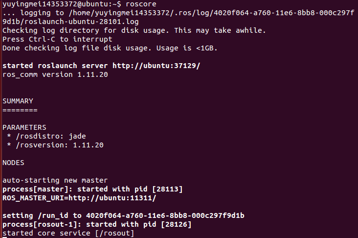
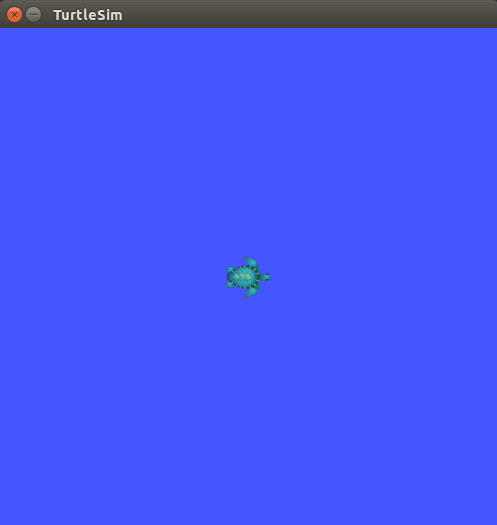
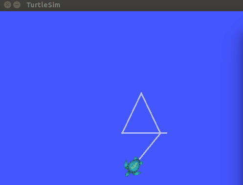
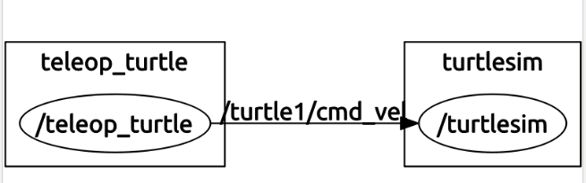

#  Ubuntu 14.04下安装ROS

### 实验环境

*Ubuntu 14.04，Ubuntu需要连网*

### 参考教程

*http://wiki.ros.org/jade/Installation/Ubuntu*

### ROS配置过程

1. 添加 sources.list

	*配置你的电脑使其能够安装来自 packages.ros.org的软件包*
		
			$   sudo sh -c 'echo "deb http://packages.ros.org/ros/ubuntu $(lsb_release -sc) main" > /etc/apt/sources.list.d/ros-latest.list'
2. 添加 keys

			$   sudo apt-key adv --keyserver hkp://pool.sks-keyservers.net --recv-key 0xB01FA116
3. 安装
	
	*首先，确保你的Debian软件包索引是最新的*

			$   sudo apt-get update
	*桌面完整版安装：（推荐） 包含ROS、rqt、rviz、通用机器人函数库、2D/3D仿真器、导航以及2D/3D感知功能*

			$   sudo apt-get install ros-jade-desktop-full
4. 初始化rosdep

	*在开始使用ROS之前你还需要初始化rosdep。rosdep可以方便在你需要编译某些源码的时候为其安装一些系统依赖，同时也是某些ROS核心功能组件所必需用到的工具*

			$   sudo rosdep init
			$   rosdep update
5. 环境配置

	*如果每次打开一个新的终端时ROS环境变量都能够自动配置好（即添加到bash会话中），那将会方便很多*

			$   echo "source /opt/ros/jade/setup.bash" >> ~/.bashrc
			$   source ~/.bashrc
	*如果你安装有多个ROS版本, ~/.bashrc 必须只能 source 你当前使用版本所对应的 setup.bash。如果你只想改变当前终端下的环境变量，可以执行以下命令：*

			$   source /opt/ros/jade/setup.bash
6. 安装 rosinstall

	*rosinstall 是ROS中一个独立分开的常用命令行工具，它可以方便让你通过一条命令就可以给某个ROS软件包下载很多源码树。*

	*要在ubuntu上安装这个工具，请运行：*

			$   sudo apt-get install python-rosinstall
	*安装过程结束*

### 测试ROS

1. 打开一个终端

			$   roscore
	*运行结果截图*
	
	 
2. 再打开一个终端，启一个小乌龟界面

			$   rosrun turtlesim turtlesim_node
	*运行结果截图*
	
	 

3. 打开第3个终端

			$   rosrun turtlesim turtle_teleop_key
	*在第3个终端上,通过键盘按下上下左右键,可看到控制小乌龟移动*

	*运行结果截图*
	
	 

4. 打开第4个终端，通过以下指令可以看到ROS nodes以及Topic等图形展示

			$   rosrun rqt_graph rqt_graph
	*运行结果截图*
	
	 
	*通过上图可知，左右两边矩形为ROS node，中间连线上的是Topic名称*

### 实验感想

本次实验配置较为简单，实验进行的很顺利，对于实验文档上的安装ROS的教程网址：http://wiki.ros.org/jade/Installation/Ubuntu，由于是英文，所以找到了对应的中文网站：http://wiki.ros.org/cn/jade/Installation/Ubuntu。

另外对于ROS的理解：本质是一个开软的软件框架，并不是一个系统，也不是语言，它实质上统一通信接口的松耦合分布方式。最大的好处是在这个框架下的软件可以即插即用，作为机器人研究，大家可以相互交流，相互的调用被人的开发结果。因为机器人有太多的研究方向，这样可以使得研究者专注于自己的方向。另外一个明显的优势是它的仿真与实体机器人的无缝转化。